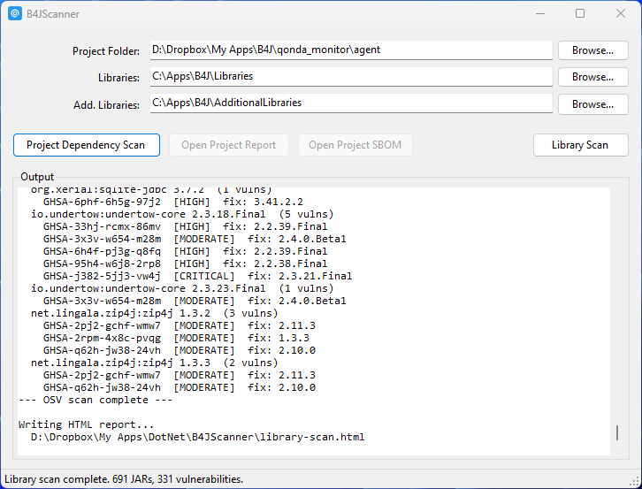

# B4JScanner

A Windows desktop tool for B4J projects that produces Software Bill of Materials (SBOM) reports and vulnerability scans. It identifies all library dependencies, resolves their versions, discovers underlying Maven JARs, generates HTML reports, and runs vulnerability checks via OSV Scanner. It can also scan library folders independently of any project to produce a standalone library inventory and vulnerability report.



---

## Getting Started

### Requirements

- Windows with .NET Framework 4.7.2 or later
- B4J Libraries folder (typically `C:\Apps\B4J\Libraries`)
- B4J AdditionalLibraries folder (typically `C:\Apps\B4J\AdditionalLibraries`)

### Building

```cmd
build.cmd
```

This invokes `csc.exe` directly from the .NET Framework folder and produces `B4JScanner.exe`. No IDE, no `.sln` or `.csproj` files, no NuGet packages, and no external dependencies are required.

### Running

Double-click `B4JScanner.exe`. The last-used folder paths are saved to `b4jscanner.cfg.json` (next to the exe) and restored on next launch.

---

## UI Overview

| Field | Purpose |
|-------|---------|
| Project Folder | Path to the B4J project folder (containing the `.b4j` file) or the `.b4j` file itself |
| Libraries | Path to the main B4J Libraries folder |
| Add. Libraries | Path to the AdditionalLibraries folder |

Buttons:

| Button | Position | When enabled | Action |
|--------|----------|-------------|--------|
| **Project Dependency Scan** | Left | Always (requires project + at least one library folder) | Parses the project, resolves all libraries, writes `.cdx.json`, `.md`, and `.html` output files, then automatically runs OSV Scanner and updates the report with vulnerability findings |
| **Open Project Report** | Left | After scan | Opens the HTML report in the default browser |
| **Open Project SBOM** | Left | After scan | Opens the raw `.cdx.json` file |
| **Library Scan** | Right | Always (requires at least one library folder) | Scans all JARs in both library folders, writes `library-scan.cdx.json` and `library-scan.html` next to `B4JScanner.exe`, runs OSV Scanner, and opens the report |

### Typical workflow

1. Select folders and click **Project Dependency Scan**
2. The scan runs automatically end-to-end: dependency resolution, SBOM generation, OSV vulnerability check
3. Click **Open Project Report** to view the completed HTML report

To scan all installed libraries independently of any specific project, click **Library Scan** with only the library folder paths set.

---

## How Dependency Discovery Works

### Step 1 - Parse the B4J Project File

The `.b4j` file is plain text. B4JScanner reads it in two passes.

**Header section** (before `@EndOfDesignText@`):

| Pattern | Extracts |
|---------|---------|
| `Library{n}=name` | Each declared library name |
| `Module{n}=name` | Module names (for reference) |
| `Build1=pkg,namespace` | Java package/namespace |
| `Version=x.y` | Project version |

**Code section** (after `@EndOfDesignText@`):

Scans every line for `#AdditionalJar:` compiler directives.

### Step 2 - Expand B4XLib Dependencies

When a `Library{n}=` entry resolves to a `.b4xlib` file, B4JScanner opens the ZIP and reads its `manifest.txt` for a `DependsOn=` line:

```
DependsOn=B4XCollections, jPOI, JavaObject, poi-ooxml-lite-5.0.0, jShell
```

Each dependency is added to the library list and recursively expanded if it is itself a `.b4xlib`. A `HashSet` prevents duplicate entries and infinite loops in circular dependency chains.

### Step 3 - Scan .bas Module Files

All `.bas` files under the project folder are also scanned for `#AdditionalJar:` directives. Duplicates across all files are removed.

```
#AdditionalJar: sqlite-jdbc-3.51.0.0_min
#AdditionalJar: h2-2.4.240
```

---

## Library Types

The HTML and Markdown reports split libraries into two tables.

### B4X Libraries table

Contains libraries that were declared via `Library{n}=` in the project file and resolved to a known B4X file type:

| Type badge | Description |
|-----------|-------------|
| **B4X Jar** | Has a `.jar` plus a `.xml` sidecar descriptor. This is the standard form for B4J wrapper libraries added via the IDE. |
| **b4xlib** | Resolved to a `.b4xlib` ZIP file. Contains B4J source code and a manifest with version and dependency info. |

### Maven Dependencies table

Contains the underlying Java JARs that are not B4X wrappers:

| Source badge | Description |
|-------------|-------------|
| **b4xlib dep** | A native Java JAR listed in a b4xlib `DependsOn=` and expanded at parse time (e.g. `poi-ooxml-lite-5.0.0` from XLUtils). |
| **AJ** | A JAR declared via `#AdditionalJar:` in source code. |
| **B4X dep** | A JAR listed in a B4X Jar's XML `<dependsOn>` element. |

---

## How Libraries Are Located

For each library name (e.g. `hikaricp`, `jserver-11.0.21`, `json`), the following strategies are tried in order, first in the **Libraries** folder then in the **AdditionalLibraries** folder:

### Strategy 1 - Exact name match

Looks for `{name}.jar` (case-insensitive).

```
Libraries\Json.jar            <- matches "json"
Libraries\HikariCP.jar        <- matches "hikaricp"
```

### Strategy 2 - Versioned subdirectory

Strips the trailing version segment from the library name and checks a subdirectory named after the base.

```
Libraries\jserver\jserver-11.0.21.jar    <- matches "jserver-11.0.21"
Libraries\jserver\jserver.jar            <- also tried
```

Version stripping: `jserver-11.0.21` becomes `jserver` by finding the last `-` where the following character is a digit.

### Strategy 3 - Prefix match

Finds any JAR in the directory (or one level of subdirectories) whose filename starts with the library name.

```
Libraries\HikariCP-2.4.6.jar                          <- matches "hikaricp"
Libraries\commons-codec\commons-codec-1.16.1.jar      <- matches "commons-codec"
```

### B4XLib fallback

If no JAR is found, B4JScanner looks for `{name}.b4xlib` in both directories.

---

## How Versions Are Extracted

Once a library is located, version information is extracted using these sources in priority order:

### 1. B4J XML Sidecar (B4X Jar)

Every B4J wrapper library ships a `.xml` file alongside its JAR. B4JScanner reads the `<version>` child element from the XML root:

```xml
<root>
  <version>2.5.1</version>
  <dependsOn>hikaricp-5.1.0/HikariCP-5.1.0.jar</dependsOn>
</root>
```

### 2. B4XLib Manifest

For `.b4xlib` files, reads `manifest.txt` from inside the ZIP:

```
Version=1.11
DependsOn=B4XCollections, jPOI, poi-ooxml-lite-5.0.0
```

### 3. JAR MANIFEST.MF

Opens the JAR as a ZIP and reads `META-INF/MANIFEST.MF`. Checks these keys in order:

- `Implementation-Version`
- `Bundle-Version`
- `Specification-Version`

### 4. JAR Filename

Extracts a version segment from the JAR filename using the pattern `[-_](\d+[\.\d]*\w*)`:

```
HikariCP-2.4.6.jar            -> 2.4.6
sqlite-jdbc-3.51.0.0_min.jar  -> 3.51.0.0_min
```

### 5. Library Name

If the library name itself contains a version suffix (same pattern), that is used:

```
jserver-11.0.21  -> 11.0.21
```

---

## How Maven Coordinates Are Identified

Maven coordinates (group ID, artifact ID, version) are resolved using up to four methods in order:

### 1. Embedded `pom.properties` (local)

Reads `META-INF/maven/*/pom.properties` from inside the JAR. Available in JARs downloaded directly from Maven Central.

```properties
groupId=com.zaxxer
artifactId=HikariCP
version=5.1.0
```

### 2. OSGi Bundle-SymbolicName (local)

Reads `Bundle-SymbolicName` from `META-INF/MANIFEST.MF`. For many well-known OSGi-bundled libraries this equals the Maven group ID. The artifact ID is derived from the JAR filename.

```
Bundle-SymbolicName: com.h2database   -> groupId = com.h2database
Filename: h2-2.4.240.jar              -> artifactId = h2
```

This handles JARs from binary distributions (e.g. H2 Database) that do not include `pom.properties`.

### 3. Maven Central name search (network, optional)

Queries `search.maven.org` with the artifact ID and version derived from the filename. Only accepted when exactly one result is returned (unambiguous match). If multiple publishers have released an artifact with the same name and version, this step is skipped and the SHA1 lookup is tried instead.

### 4. SHA1 fingerprint (network, last resort)

Computes a SHA1 hash of the JAR file and queries Maven Central's checksum lookup. This is the most reliable method for binary-distribution JARs (e.g. Apache POI) where neither `pom.properties` nor `Bundle-SymbolicName` is available, and where the name search is ambiguous.

If the name search found multiple candidates but the SHA1 lookup also fails (e.g. offline), the PURL column shows `ambiguous: N matches on Maven Central`. If a network error occurs, the error message is shown in place of the PURL.

Network lookups are **opt-in**: on the first scan, B4JScanner asks for confirmation before connecting to `search.maven.org`. The answer is saved in `b4jscanner.cfg.json`.

---

## How Underlying B4X JAR Dependencies Are Resolved

The B4J XML sidecar can declare underlying JAR dependencies via `<dependsOn>` elements:

```xml
<dependsOn>jserver-11.0.21/jetty-server-11.0.21.jar</dependsOn>
<dependsOn>hikaricp-5.1.0/HikariCP-5.1.0.jar</dependsOn>
```

For each dependency B4JScanner:

1. Constructs the expected path (e.g. `Libraries\jserver-11.0.21\jetty-server-11.0.21.jar`)
2. Falls back to a flat filename search in the root of each library directory
3. Reads `pom.properties` from inside the found JAR to get real Maven coordinates
4. Adds the dependency to the Maven Dependencies table with a `pkg:maven` PURL

Dependencies are deduplicated by PURL across all libraries.

---

## Java Source Scanning

B4JScanner scans `{ProjectFolder}\Objects\src\` recursively for all `.java` files. From each file it extracts:

- The `package` declaration
- All `import` statements

The following namespaces are filtered out as they are B4J framework or standard library internals:

- `anywheresoftware.*`
- `java.*`
- `javax.*`
- `android.*`

The remaining imports are collapsed to their two-segment prefix (e.g. `com.zaxxer`, `org.eclipse`) and listed in the SBOM and HTML report as external references.

---

## Output Files

### Project scan output

Three files are written to the project folder after a **Project Dependency Scan**.

#### `{ProjectName}.html`

A self-contained HTML report viewable in any browser.


Sections:

- Summary cards (B4X Libraries, Found, Not Found, Maven Deps, Vulnerabilities, Critical, High)
- Project info
- **B4X Libraries** table: B4X Jar and b4xlib entries with version, type badge, dependency count, Found/Missing status, and Java package name
- **Maven Dependencies** table: native JARs from b4xlib expansion, `#AdditionalJar` entries, and B4X `<dependsOn>` deps, each with group ID, artifact ID, version, source badge, and PURL
- **Non-Maven Dependencies** table: JARs that could not be identified with Maven coordinates
- Vulnerabilities with severity badges and fix versions (included automatically)
- Java import prefixes

#### `{ProjectName}.cdx.json`

A [CycloneDX 1.5](https://cyclonedx.org/specification/overview/) JSON SBOM. Contains:

- Project metadata (name, version, Java package)
- One component per library with PURL, version, and B4J-specific properties
- One component per resolved Maven dependency (deduplicated)
- External references for Java import prefixes found in `Objects/src`

B4J-specific properties on each component:

| Property | Value |
|---------|---------|
| `b4j:libraryName` | Original name as declared in the project |
| `b4j:found` | `true` / `false` |
| `b4j:jarPath` | Absolute path to the resolved JAR |
| `b4j:xmlPath` | Absolute path to the sidecar XML (if found) |
| `b4j:b4xlibPath` | Absolute path to the .b4xlib (if used) |
| `b4j:versionSource` | Where the version came from (`xml`, `b4xlib-manifest`, `manifest:*`, `filename`, `library-name`) |
| `b4j:dependsOn` | Repeated for each underlying dependency name |

#### `{ProjectName}.md`

A Markdown report with the same content as the HTML report (without vulnerability data).

### Library scan output

Two files are written next to `B4JScanner.exe` after a **Library Scan**.

#### `library-scan.html`

A self-contained HTML report covering the entire library folder contents.

Sections:

- Summary cards (JARs Scanned, Identified, Unidentified, Vulnerabilities, Critical, High)
- **High / Critical Findings** table: one row per affected package with severity pill counts and a link to the full vulnerability detail (only shown when findings exist)
- **Identified JARs** table: JARs where Maven coordinates were resolved, with group ID, artifact ID, version, and PURL (collapsible)
- **Unidentified JARs** table: JARs with no Maven metadata; B4J library JARs (those with a `.xml` sidecar) are flagged with a **B4J** badge (collapsible)
- **Vulnerabilities** detail: per-package tables with severity badges, CVE aliases, and fix versions (collapsible)

All sections are collapsible. Cards link to their corresponding section.

#### `library-scan.cdx.json`

A CycloneDX 1.5 SBOM covering all identified JARs (those with resolvable Maven coordinates), used as input to OSV Scanner.

---

## Vulnerability Scanning

Both **Project Dependency Scan** and **Library Scan** run OSV Scanner automatically at the end of each scan. No separate step is required.

B4JScanner looks for `osv-scanner` in this order:

1. Any file matching `osv-scanner*` in the same folder as `B4JScanner.exe`
2. `osv-scanner` on the system PATH

The scanner is invoked with JSON output:

```
osv-scanner --format json -L "{sbom}.cdx.json"
```

The file must have the `.cdx.json` extension (required by osv-scanner). Download osv-scanner from [https://github.com/google/osv-scanner/releases](https://github.com/google/osv-scanner/releases) and place the `.exe` next to `B4JScanner.exe`.

The HTML report is generated with vulnerability results included. The report shows severity badges (CRITICAL, HIGH, MEDIUM, LOW), CVE aliases, and the recommended fix version for each finding. Critical and High counts appear as dedicated summary cards.

---

## Configuration File

`b4jscanner.cfg.json` is saved next to `B4JScanner.exe` automatically.

```json
{
  "projectFolder": "D:\\Projects\\MyApp",
  "librariesPath": "C:\\Apps\\B4J\\Libraries",
  "additionalLibrariesPath": "C:\\Apps\\B4J\\AdditionalLibraries",
  "mavenSearchEnabled": true
}
```

| Field | Description |
|-------|-------------|
| `projectFolder` | Last-used B4J project path, pre-filled on next launch |
| `librariesPath` | Path to the main B4J Libraries folder |
| `additionalLibrariesPath` | Path to the AdditionalLibraries folder |
| `mavenSearchEnabled` | `true` to allow queries to `search.maven.org`, `false` to disable, `null` (or absent) to be prompted on the next scan |

To reset the Maven Central consent, set `mavenSearchEnabled` to `null` or remove the field from the file.
